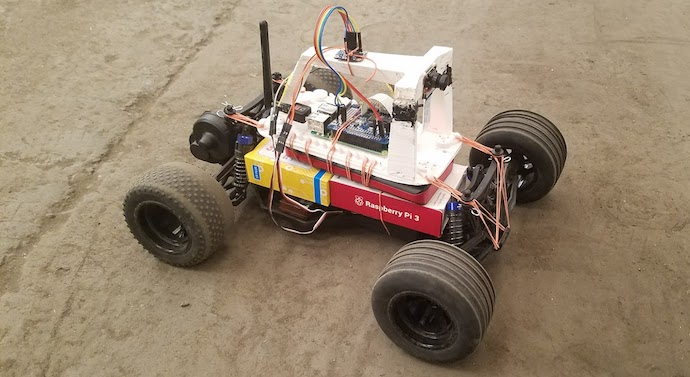

# IRONCAR



## HARDWARE

Google doc with tutorial https://docs.google.com/document/d/1jyRhlbmthMA_DuuulYnzUT38okIF_KFZH0a4hh8NCg8/edit?usp=sharing .

## SETUP

### Raspberry Pi
Clone this repo on your Raspberry Pi :

```
git clone https://github.com/vinzeebreak/ironcar.git
cd ironcar
```

#### Easy setup with install.sh

You can easily setup everything on the raspi using the `install.sh` bash. To do so, go on your raspi and do:
```
$ ./install.sh
```

It will install *[keras](https://github.com/keras-team/keras)*, *[tensorflow](https://www.tensorflow.org/)*, *[nodejs](https://nodejs.org/)* and some other dependencies in the requirements. This should take 2-3 hours... (*scipy* is very long to install). At the end of the install, you will need to choose if you want to enable the pi camera, i2c connections and augment the swap size (which is very small by default). 
And that's it, you should be ready to go to the launching part!!

#### Manual setup

You can install the requirements from `requirements_raspi.txt` yourself, but you will need to install *tensorflow* as well as *nodejs* and *npm*. You will also need to install the node packages from `package.json` using the `npm install` command. 
Last you will need to configure your camera and any other device to be enabled on the raspi. 

### Laptop
You need to install the `requirements_laptop.txt` on your laptop only if you want to train your car with a gamepad and with the `controller.py` script. You can do it like this:
```
$ pip3 install -r requirements_laptop.txt
```
Otherwize, there is nothing needed for this part on the laptop, you will only use your browser to connect to the raspi via a node client. 

## Launching
In order to communicate between the car and the laptop or another device like a smartphone, we used [socket.io](https://socket.io/) on python and nodejs. Therefore, we need to launch a server node on the raspi and clients on other devices. A python client on the raspi ensures the communication with the 
car hardware (motors, camera  and other potential sensors if you want to add any).


### On the Raspberry Pi
Two programs are to be launched on the raspi. You can use `screen` if you don't want to carry a laptop. Those two programs can be run as daemon if you really don't want to use a laptop.

* server node: 
```
$ node car_server.js
``` 
This will launch the node server. By default, it runs on 
the raspi localhost on the port 8000. 
* python client: 
```
$ python3 ironcar_master.py
``` 
This will launch the python client that directly
controls the car and takes commmands from the node server.

### On the laptop
If you have a gamepad to control the car in training/direction auto and you want to control it, you can launch `controller.py` on the laptop (don't forget to change the ip to put your raspi's ip)
You might need to change this script to adapt to your gamepad.  
As an example, we used a xbox gamepad and listened to the left joystick for direction and `RT` trigger for the gas, `LT` to break. 

### On any device
The user interface is a javascript client that can be launched in any browser in theory 
(firefox, chrome and safari have been tested). Just go to `YOUR_RASPI_IP:8000` and you should be able to choose the mode, the model, the speed, and control the car with a keyboard (the keyboard is obviously not supported if you connect from a smartphone!).

## Training

In order to train the car to drive itself, you need 2 things:
- some data of the race
- a model

### Data

It is way too long to train the car by driving it with a remote controller. That's why we created a simulator. Nothing too fancy, it's quite easy to use. Just go [there](https://github.com/vinzeebreak/road_simulator) and follow the instructions.

### Model

The model is also given [there](https://github.com/vinzeebreak/road_simulator).
